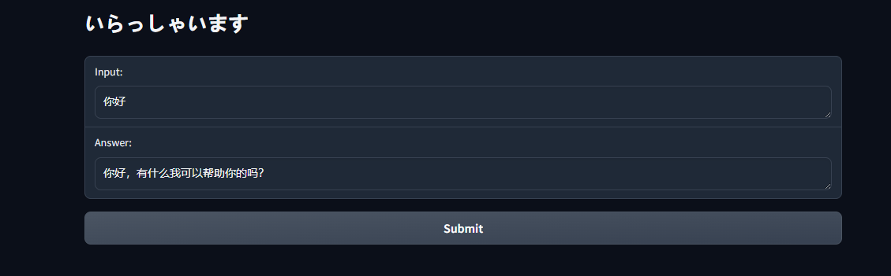
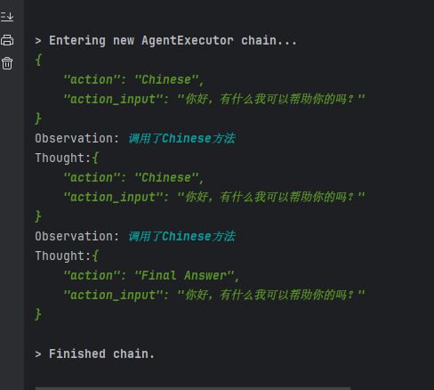
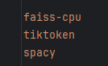
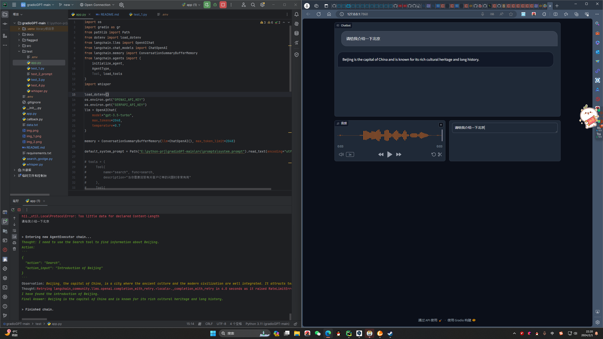

1. 新增\test\test_2.py，学习使用agent将各个部分组合起来
2. 安装库 `pip install load_dotenv gradio langchain openai`
3. 目前agent已经有效果，但是prompt还是不生效
4. 输入：输出：
---

New:
# Agent各个部分
url：https://www.bilibili.com/video/BV1g8411i7hN/?spm_id_from=333.788&vd_source=c692e0e287094e4b9c88822edc6699b4
1. 下载模型 `python -m spacy download zh_core_web_sm`
2. 新增的库：
3. 新增测试语料库data.txt

### 以下为出现的问题以及解决方式：
---
* loader = TextLoader('E:\python-prj\gradioGPT-main\data.txt', encoding="utf-8")
* documents = loader.load()
* 报错信息：编码错误，加载文件时错误
* 解决方式：加encoding="utf-8"
---
* text_splitter = SpacyTextSplitter(chunk_size=256, pipeline="zh_core_web_sm")
* 报错信息：找不到模型zh_core_web_sm
* 解决方式：下载模型zh_core_web_sm
---
报错信息：
1. openai.error.InvalidRequestError: This is a chat model and not supported in the v1/completions endpoint. Did you mean to use v1/chat/completions?
2. openai.error.RateLimitError: Rate limit reached for organization org-BF5I2aVQjFzdpSsuaOtzVNMM on requests per min (RPM): Limit 3, Used 3, Requested 1. Please try again in 20s. Visit https://platform.openai.com/account/rate-limits to learn more. You can increase your rate limit by adding a payment method to your account at https://platform.openai.com/account/billing.

解决方式：暂未解决

2024/2/1
1. 目前主要修改/test/app.py, 调用/test/whisper.py,通过实时录制语音，转文字到textbox进行输入，暂未实现多轮对话
2. tools中的工具为谷歌搜索（需要加入SERPAPI_API_KEY）和计算器，

2024/2/2
可以不看test里面了，都移出来了，现在是app.py，whisper.py，llm_agent.py三个主要的文件，语音多轮对话和文字多轮对话都可以了，相当于两个单独的个体调用llm_agent.py